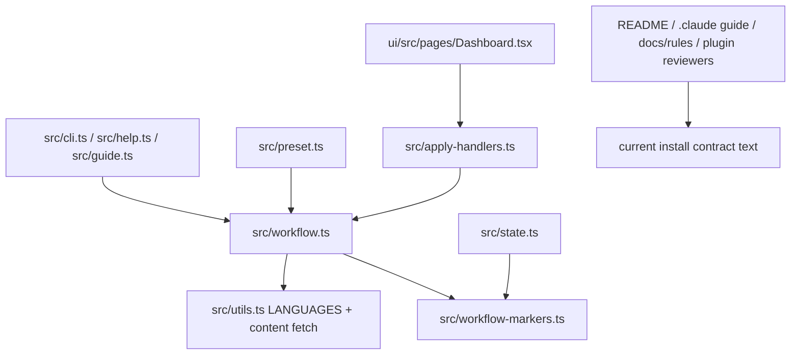
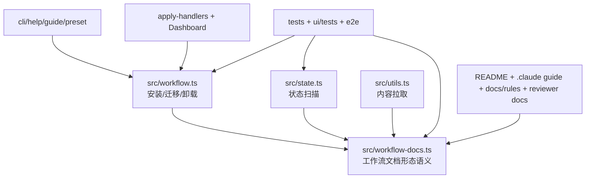

# 架构设计:AGENTS.md 主文件与中文默认安装

## Context & Current State / 背景与现状

本设计接住 `docs/specs/agents-primary-zh-default/spec.md` 的目标:工作流主文件从 `CLAUDE.md` 翻转为 `AGENTS.md`,默认语言从英文改为中文,并安全迁移旧安装形态。

当前结构的问题不是单个文件名写错,而是“工作流文档”这个概念在多个模块里被等同为 `CLAUDE.md`:安装器写 `CLAUDE.md`,状态扫描读 `CLAUDE.md`,语言模板以 `CLAUDE.md` 命名,帮助和网页文案也把 `CLAUDE.md` 写成主体。这个耦合会让翻转文件方向时容易漏改某个表面。



## Design Drivers & Constraints / 设计驱动与约束

**设计驱动**
- 迁移安全 — 旧项目里可能同时存在用户手写 `CLAUDE.md`、旧安装软链和外部 `AGENTS.md`;任何路径翻转都不能丢内容。
- 影响半径 — 改动会横跨安装器、扫描器、命令行、网页和文档,需要一个小的共享语义点,避免每处各自拼路径。
- 包形态正确 — 非开发模式下内容来自发布包和 GitHub tag 拉取,默认中文不能只在源码树中可用。
- 命名一致性 — 对外契约以后说 `AGENTS.md` 主体,内部命名可以渐进迁移,但新的结构不能继续扩大 `CLAUDE.md` 主体假设。

**约束与不变量**
- `validation-contract.md` 中的所有 VAL 都必须保持可验证。
- `--lang en|zh-CN` 的取值集合不变;英文仍可显式安装。
- 受管块 schema 默认不变;只有在实现证明旧解析无法兼容时才另行升级。
- skills、recommended skills、plugins 的安装路径和默认集合不变。

**行为保护网**
- 第一批结构性修改前要先补或更新工作流安装测试,覆盖 fresh install、旧形态翻转、foreign `AGENTS.md`、备份不覆盖和英文显式安装。
- 状态扫描和默认语言要由 `tests/state.test.ts`、`tests/preset.test.ts`、`tests/apply-handlers.test.ts`、`ui/tests/Dashboard.test.tsx` 等现有套件锁住。

## Candidate Approaches / 候选方案

### 候选 A:最小原地改
- **形状**:继续在 `workflow.ts`、`utils.ts`、`state.ts`、CLI、Web UI 和文档里直接把 `CLAUDE.md` 改成 `AGENTS.md`,局部补迁移分支。
- **优点**:文件数量少,短期实现最快;不需要引入新概念。
- **缺点**:`CLAUDE.md` 主体假设会继续散落在旧命名和注释中;后续做文档普查、状态扫描或发布包修复时容易重复推导同一组路径规则。

### 候选 B:中性命名的工作流文档层
- **形状**:保留现有外部安装入口,但把“主文件、兼容软链、语言模板、备份槽、旧形态识别”集中为一层工作流文档语义。安装器、扫描器、内容拉取和文案测试都从这一层消费文件形态,而不是各自硬编码 `CLAUDE.md` 主体。
- **优点**:把真正变化的边界收在一处;旧形态迁移和新形态安装可以共享同一套路径事实;内部命名可按影响半径渐进调整。
- **缺点**:比原地改多一层概念,需要更新更多测试 helper 和注释来避免新旧命名混杂。

### 候选 C:泛化指令管理器
- **形状**:把工作流文档抽象成可配置的多入口指令文件系统,支持任意主文件、多个兼容文件、可扩展语言和未来 Agent 规范。
- **优点**:长期弹性最大;以后再加新的指令文件规范时可复用。
- **缺点**:当前只有一个确定迁移目标,泛化会引入没有真实调用方的配置面、错误分支和测试矩阵。

## Tradeoff Comparison / 权衡对比

| 驱动 | 候选 A:最小原地改 | 候选 B:中性命名的工作流文档层 | 候选 C:泛化指令管理器 |
|---|---|---|---|
| 迁移安全 | 迁移判断分散在安装器和测试里,每个冲突路径都要人工同步 | 主/兼容路径、旧形态和备份槽集中表达,冲突处理更容易被完整覆盖 | 路径策略可配置,但分支数量增加,反而扩大迁移测试面 |
| 影响半径 | 初始 diff 小,但多处仍会出现 `CLAUDE.md` 主体残留 | 中等 diff,但把未来读取者需要理解的核心规则收拢 | 最大 diff,需要改更多调用点和类型 |
| 包形态正确 | 容易只改本地模板名而漏掉 `CONTENT_FILES` 和按需拉取 | 内容文件清单和语言模板归入同一语义层,更容易同时检查 | 可覆盖,但为两种语言引入过重配置 |
| 命名一致性 | 对外变成 `AGENTS.md`,内部仍大面积 `claude` 命名 | 新增代码和持久说明都用 `AGENTS.md` 主体,旧名称只在兼容路径出现 | 最干净但过度抽象,会把当前问题扩大成平台框架 |

## Decision & Rationale / 选定方案与理由

- **选定**:候选 B:中性命名的工作流文档层。
- **决定它的驱动**:迁移安全和影响半径。当前需求跨多个表面,但真正要共享的是文件形态和语言默认值这两组事实。
- **放弃了什么**:放弃候选 A 的最短路径,换取迁移逻辑和文案普查的集中参照;放弃候选 C 的长期泛化,避免为假想的未来 Agent 文件规范付复杂度。
- **否决理由**:候选 A — 短期快,但会把 `CLAUDE.md` 主体假设继续留在多个模块;候选 C — 没有第二个真实主文件规范作为当下驱动。
- **迁移形态**:并行变更。新结构先同时识别旧形态和新形态,安装时把旧形态迁到新形态;验证通过后当前契约只把新形态作为已安装目标。

## Target Structure / 目标结构

**目录概览**

```
auriga-cli/
  AGENTS.md                 (改:产品模板主文件)
  AGENTS.zh-CN.md           (新增或改:中文产品模板主文件)
  CLAUDE.md                 (改:指向 AGENTS.md 的兼容软链)
  CLAUDE.zh-CN.md           (删或兼容处理:由 plan 判定是否保留为拉取兼容入口)
  src/
    workflow-docs.ts        (新增:主文件/兼容软链/语言模板/备份槽语义)
    workflow.ts             (改:消费 workflow-docs,执行安装和迁移)
    workflow-markers.ts     (改:注释与函数语义从 CLAUDE 主体迁到工作流文档)
    state.ts                (改:扫描 AGENTS 主体,保留旧形态兼容判断)
    utils.ts                (改:内容文件清单与语言模板默认中文)
    cli.ts/help.ts/guide.ts (改:默认值和用户文案)
    preset.ts               (改:默认语言说明)
    apply-handlers.ts       (改:Web UI apply 默认中文)
    api-types.ts/server.ts  (改:语言与 workflow 文档描述)
  ui/
    src/pages/Dashboard.tsx (改:默认语言和文案)
    tests/                  (改:默认语言与文件形态断言)
  tests/
    workflow-install.test.ts
    workflow-uninstall.test.ts
    state.test.ts
    preset.test.ts
    apply-handlers.test.ts
    install-nontty.test.ts
    e2e-install.test.ts
    content-fetch.test.ts
  docs/
    rules/agent-portability.md                 (改:AGENTS 主体约定)
    specs/agents-primary-zh-default/           (新增:本设计)
  plugins/auriga-workflow/skills/deep-review/
    references/reviewers/skill-plugin-quality.md (改:指令文件审查建议)
```

**模块依赖图**



## Risks & Rollback / 风险与回滚

- **风险**:符号链接翻转时误跟随链接,把内容写到错误目标 → **缓解**:所有存在性判断用 `lstat` 语义;备份软链时保留链接本身的字面目标。
- **风险**:默认中文只在开发模式成立,发布包安装拉不到中文主模板 → **缓解**:内容文件清单和端到端 tarball 测试覆盖默认中文与显式英文。
- **风险**:文档普查把历史 worklog 改成当前口径,丢失历史事实 → **缓解**:只改当前契约文档、源码注释和测试说明;归档 worklog 默认保留。
- **回滚**:如果实现过程中发现中性层引入的改动超过收益,可退回候选 A 的原地改,但保留已写的迁移安全测试和文案普查 VAL。

## Cross-Module Impact / 对其他模块的影响

- `src/workflow.ts` — 安装、升级、迁移、卸载的主路径从 `CLAUDE.md` 主体切到 `AGENTS.md` 主体。
- `src/state.ts` — 项目工作流扫描主路径变更,并需要兼容识别旧形态。
- `src/utils.ts` — 默认语言和内容文件清单变更,影响非开发模式拉取。
- `src/cli.ts` / `src/help.ts` / `src/guide.ts` / `src/preset.ts` — 默认值、提示和菜单标签同步中文默认与新文件形态。
- `src/apply-handlers.ts` / `ui/src/pages/Dashboard.tsx` — Web UI 默认语言和工作流文案同步。
- `tests/` 与 `ui/tests/` — 大量断言需要从旧文件形态改为新文件形态,并补旧形态迁移回归。
- `.claude/CLAUDE.md`、README、`docs/rules/agent-portability.md`、deep-review reviewer 文档 — 当前契约说明需要改成 `AGENTS.md` 主体。

## Consequences / 后果

- **得到的**:对外契约与社区 `AGENTS.md` 规范对齐;中文成为真正默认;迁移和扫描共享一套文件形态语义。
- **要承受的**:短期会触及较多测试和说明文本;内部仍会有少量历史 `CLAUDE` 命名需要作为兼容语义保留。
- **需要后续跟进的**:PR Ready 前要决定 `docs/specs/agents-primary-zh-default/` 是归档到 worklog 还是提炼成长期架构文档。

## Open Questions / 未决问题

- `CLAUDE.zh-CN.md` 是否保留为兼容远程拉取入口,还是随主文件改名为 `AGENTS.zh-CN.md` 后只保留新入口。这个问题不影响行为契约,但会影响发布后旧版本 CLI 是否能继续按 tag 拉取内容。
