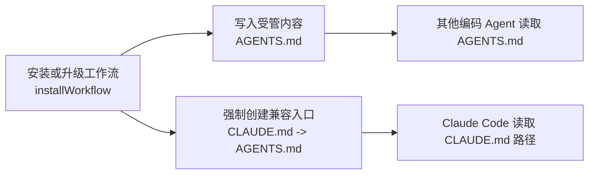
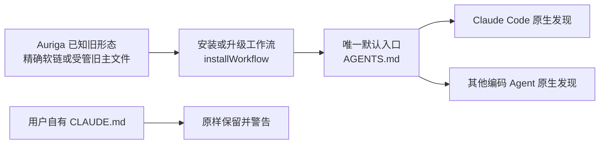
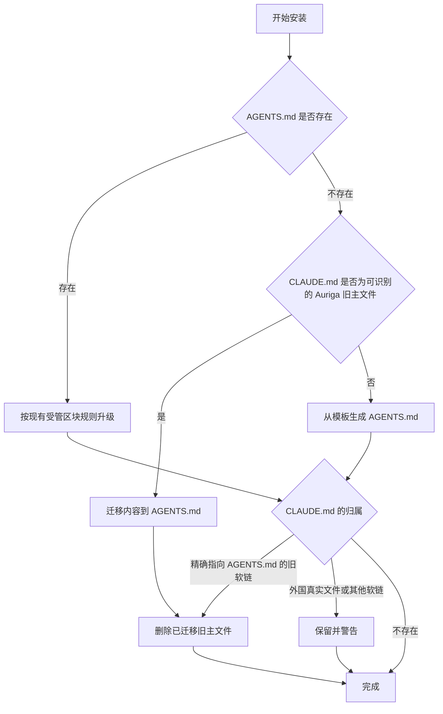

# 架构设计：原生 AGENTS.md 工作流入口

## 1. 人工评审重点

- **评审状态**：已确认
- **核心决定**：`AGENTS.md` 成为 workflow 安装的唯一默认输出；`CLAUDE.md` 只作为历史迁移输入或用户显式兼容入口。
- **主要影响**：`installWorkflow` 的文件迁移状态机、工作流契约测试、双语模板、`documentation-management` 技能、README / guide / help 与版本号。
- **质量保障重点**：自动退场只作用于 Auriga 可证明拥有的文件形态；用户自有 `CLAUDE.md` 必须原样保留。
- **首要风险**：项目保留真实 `CLAUDE.md` 时，Claude Code 默认不会读取新生成的 `AGENTS.md`；安装器必须明确提示，但不能替用户删除或改写该文件。
- **待确认项**：无。

## 2. 架构总览

### 2.1 当前架构现状

当前安装器把 `AGENTS.md` 作为内容主文件，但每次都创建 `CLAUDE.md -> AGENTS.md`；这个兼容入口使 Claude Code 默认不走原生 `AGENTS.md` 分层发现。



#### 2.1.1 当前目录结构

```text
auriga-cli/
├── src/
│   ├── workflow.ts
│   └── workflow-docs.ts
├── tests/
│   ├── workflow-install.test.ts
│   ├── workflow-uninstall.test.ts
│   └── state.test.ts
├── AGENTS.template.zh-CN.md
├── AGENTS.template.en.md
└── plugins/auriga-workflow/skills/documentation-management/SKILL.md
```

#### 2.1.2 当前事实依据

- `src/workflow.ts`：无条件用 `fs.symlinkSync` 创建 `CLAUDE.md -> AGENTS.md`，并会备份替换既有真实文件或外国软链。
- `src/state.ts`：项目状态优先读取 `AGENTS.md`，并保留 `CLAUDE.md` 历史回退。
- `src/workflow.ts#uninstallWorkflow`：能区分精确的两代 Auriga 软链和用户自有软链。
- `AGENTS.template.*.md` 与 `documentation-management/SKILL.md`：要求每个独立子包维护兼容软链。

### 2.2 目标设计概览

安装器只输出 `AGENTS.md`；升级时对 Auriga 已知旧形态做一次显式收缩，对无法证明归属的 `CLAUDE.md` 保持只读并给出人工兼容提示。



#### 2.2.1 设计边界

- **目标**：默认安装形态只有 `AGENTS.md`；现有 Auriga 兼容入口可安全收缩；长期规范不再要求软链。
- **非目标**：不新增安装参数，不管理 Claude Code 用户设置，不改变 user scope 工作流文件，不清理历史文档。
- **约束与不变量**：只有内容或软链目标能证明由 Auriga 管理时才自动删除；项目自定义区与首个备份槽语义保持不变；中英文模板同步。
- **必须保持的兼容行为**：旧版 Auriga 形态仍可升级、扫描和卸载；外国 `AGENTS.md` 继续并入用户区；外国 `CLAUDE.md` 不丢失。

#### 2.2.2 目标目录结构

```text
auriga-cli/
├── src/
│   ├── workflow.ts                                      （改）
│   └── workflow-docs.ts                                 （改注释或命名）
├── tests/
│   ├── workflow-install.test.ts                         （改）
│   ├── workflow-uninstall.test.ts                       （改）
│   ├── state.test.ts                                    （保留历史兼容断言）
│   └── e2e-install.test.ts                              （改）
├── AGENTS.template.zh-CN.md                             （改）
├── AGENTS.template.en.md                                （改）
├── plugins/auriga-workflow/skills/documentation-management/SKILL.md （改）
├── README.md / README.zh-CN.md                          （改）
└── src/guide.ts / src/help.ts / src/cli.ts / src/preset.ts          （改）
```

## 3. 分项设计

### 3.1 安装与迁移边界

#### 3.1.1 原始需求

- `spec.md#VAL-INSTALLATION-001`：新安装只生成受管 `AGENTS.md`。
- `spec.md#VAL-MIGRATION-001`：Auriga 管理的两代旧形态迁移为单一 `AGENTS.md`。
- `spec.md#VAL-SAFETY-001`：用户自有 `CLAUDE.md` 不被覆盖。
- `spec.md#VAL-COMPATIBILITY-001`：旧形态继续可扫描和卸载。

#### 3.1.2 设计

`installWorkflow` 继续以 `AGENTS.md` 为主文件，不新增抽象层。`CLAUDE.md` 的职责从“每次安装的输出”收窄为“历史迁移输入”：

- 精确的 `CLAUDE.md -> AGENTS.md` 由旧版 Auriga 创建，可直接删除且无需备份。
- 当 `AGENTS.md -> CLAUDE.md` 且真实 `CLAUDE.md` 含受管区块或 Auriga header 时，沿用现有内容迁移逻辑写入真实 `AGENTS.md`，确认用户区已保留后删除旧主文件。
- 单独存在、且可识别为 Auriga 受管或旧格式的真实 `CLAUDE.md`，同样迁移后删除；损坏标记先走现有备份保护。
- 真实外国 `CLAUDE.md` 或指向其他目标的软链不参与内容迁移、不产生替换备份、保持原样；安装器警告 Claude Code 默认会优先读取它，并指向手动 `@AGENTS.md` 导入或删除该文件的恢复方法。

这个边界让所有自动删除都能由已知 Auriga 标记或精确软链证明归属；不为追求默认生效而接管用户文件。

#### 3.1.3 局部目录变化

```text
src/
├── workflow.ts          （改：兼容入口从输出改为迁移输入）
└── workflow-docs.ts     （改：常量语义改为 legacy）
tests/
├── workflow-install.test.ts （改：新形态、两代迁移、外国文件保护）
├── workflow-uninstall.test.ts（保留历史卸载兼容）
└── e2e-install.test.ts      （改：真实包只生成 AGENTS.md）
```

- **职责落点说明**：迁移判断仍留在 `workflow.ts`，因为它与受管区块合并、备份和文件归属判断共享同一事务边界；不新增迁移框架或兼容开关。

#### 3.1.4 流程与必要图示



**图示说明与设计理由**：先确定权威内容来源，再收缩兼容入口，避免先删文件导致迁移数据丢失；无法证明归属时宁可留下明确告警，也不静默修改用户资产。

#### 3.1.5 验证

- `VAL-INSTALLATION-001`：临时目录的新安装文件系统断言。
- `VAL-MIGRATION-001`：两代旧形态的内容、文件类型与无悬空链接断言。
- `VAL-SAFETY-001`：外国真实文件与外国软链的字节 / 目标保持断言。
- `VAL-COMPATIBILITY-001`：状态扫描与卸载现有回归测试。

### 3.2 规范与发布表面

#### 3.2.1 原始需求

- `spec.md#VAL-DOCUMENTATION-001`：活跃规范统一原生策略。
- `spec.md#VAL-DOCUMENTATION-002`：旧环境的显式兼容方法可发现。

#### 3.2.2 设计

双语工作流模板和 `documentation-management` 技能删除“每层保持兼容软链”的不变量，只保留 `AGENTS.md` 分层与父级索引要求。README 作为人类安装入口承载 Claude Code 的最低版本、不可用环境、手动兼容方法和验证方式；guide / help / CLI 只同步默认产物名称，不复制完整兼容解释。

这是用户可见安装行为与插件技能正文的变化，因此按仓库规则提升 CLI 版本，并同步 `auriga-workflow` 的各宿主 manifest 版本与 marketplace 版本。历史 worklog 保持当时事实，不追改。

#### 3.2.3 验证

- `VAL-DOCUMENTATION-001`：双语模板契约、插件 manifest 一致性和活跃文件反向搜索。
- `VAL-DOCUMENTATION-002`：README 权威说明的内容审查与官方链接检查。

## 4. 迁移与行为保护

- **迁移方式**：一次显式切换；新安装立即采用单文件形态，升级时在同一次安装中收缩已知兼容入口。
- **中间状态与兼容窗口**：状态扫描和卸载无限期保留对历史形态的只读 / 清理兼容；安装器不再创建新兼容入口。
- **切换信号**：定向迁移测试、新安装测试、文档契约和完整仓库测试通过。
- **行为保护**：受管标记与精确软链目标证明 Auriga 所有权；现有 backup-once 规则继续保护损坏或手改的旧主文件。
- **回滚条件**：若测试发现无法区分用户文件与 Auriga 文件，则停止自动删除该类路径，降级为保留并警告。
- **旧路径删除条件**：安装输出与活跃规范中立即删除；状态扫描、卸载和历史迁移识别继续保留。
- **负责人**：当前任务执行者负责本次切换，后续历史兼容清理由未来独立决策处理。

### 4.1 资产退场清单

| 准确路径 | 资产或符号 | 当前依赖证据 | 处置 | 为什么 |
|---|---|---|---|---|
| `src/workflow.ts` | 无条件创建 `CLAUDE.md -> AGENTS.md` 的尾部逻辑 | 安装测试、端到端测试、guide/help/README | 删除并替换为旧形态收缩逻辑 | 默认输出改为原生 `AGENTS.md` |
| `AGENTS.template.zh-CN.md` | 每个子包保留兼容软链的规则 | 根 `AGENTS.md` 由模板生成，安装器发布模板 | 修改 | 避免阻止 Claude Code 原生下层发现 |
| `AGENTS.template.en.md` | 同上英文规则 | 双语模板契约 | 修改 | 保持双语一致 |
| `plugins/auriga-workflow/skills/documentation-management/SKILL.md` | 每层保持兼容软链的不变量 | 插件技能直接指导项目文档治理 | 修改 | 改为单一 `AGENTS.md` 分层入口 |
| `README.md` / `README.zh-CN.md` | 默认创建软链的安装说明 | 人类安装入口 | 修改 | 说明新默认与显式兼容方法 |
| `src/guide.ts` / `src/help.ts` / `src/cli.ts` / `src/preset.ts` | `AGENTS.md/CLAUDE.md` 默认产物描述 | 命令行用户界面与测试 | 修改 | 与真实输出一致 |
| `tests/workflow-install.test.ts` / `tests/e2e-install.test.ts` | 创建兼容软链的稳定断言 | 当前行为保护网 | 修改 | 保护新的单文件契约与迁移安全 |
| `src/state.ts` / `tests/state.test.ts` | `CLAUDE.md` 历史回退 | 已发布旧项目仍存在 | 保留 | 只读兼容不妨碍新默认 |
| `src/workflow.ts#uninstallWorkflow` / `tests/workflow-uninstall.test.ts` | 两代软链卸载识别 | 已发布旧项目仍存在 | 保留 | 安全清理历史安装形态 |
| `docs/worklog/**` | 旧版本形态的历史记录 | 归档证据 | 保留 | 历史事实不追改 |

## 5. 质量风险与保障

| 风险维度 | 风险与影响 | 保障方式 | 验证方式与通过标准 |
|---|---|---|---|
| 用户数据安全 | 误删真实 `CLAUDE.md` 会丢失项目专属指令 | 仅精确软链或可识别 Auriga 内容可自动退场；其余保留并警告 | `VAL-SAFETY-001` 的字节与软链目标保持测试通过 |
| 兼容性 | 旧版 / Bedrock 等 Claude 会话不读取 `AGENTS.md` | README 提供显式 `@AGENTS.md` 导入或软链方法，不把兼容层继续设为默认 | `VAL-DOCUMENTATION-002` 审查通过 |
| 迁移正确性 | 两代旧安装形态可能留下悬空链接或丢用户区 | 先迁移内容、再删除旧入口，保留 backup-once 规则 | `VAL-MIGRATION-001` 的两代迁移测试通过 |

## 8. 人工确认结果

- 已确认默认采用原生 `AGENTS.md`，不增加兼容选项。
- 已确认用户自有 `CLAUDE.md` 原样保留并警告，不由安装器接管。

## 9. 参考依据

| 来源 | 版本或修订 | 条款或代码证据 | 设计落点 |
|---|---|---|---|
| 当前会话用户决定 | 2026-09-19 | 原生 `AGENTS.md` 默认策略 | 2.2、3.1、3.2 |
| [Claude Code 官方 memory 文档](https://code.claude.com/docs/en/memory) | 2026-09-19 读取 | v2.1.277、默认选择规则、不支持场景、旧 workaround 处置 | 2.1、3.1、5 |
| `src/workflow.ts` | `ae24a70` | `installWorkflow` / `uninstallWorkflow` | 2.1、3.1、4 |
| `src/state.ts` | `ae24a70` | `workflowPathsForScope` | 3.1、4 |
| `AGENTS.template.*.md` | `ae24a70` | Harness Principles / 运行框架原则 | 3.2、4.1 |
| `plugins/auriga-workflow/skills/documentation-management/SKILL.md` | `ae24a70` | 面向 Agent 的分层规则 | 3.2、4.1 |
