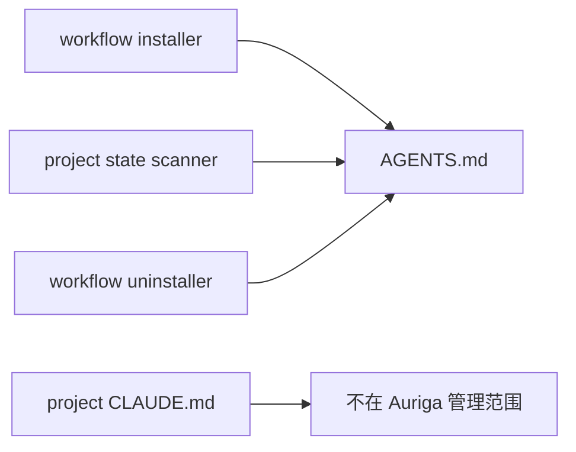

# 架构设计：原生 AGENTS.md 单一入口

## 1. 决定

- **状态**：已确认。
- **核心决定**：项目工作流的唯一文件边界是 `AGENTS.md`；删除所有项目级 `CLAUDE.md` 回退、迁移、清理和提示逻辑。
- **理由**：Claude Code 已原生支持 `AGENTS.md`，兼容层不再提供足以覆盖维护成本的价值。
- **破坏性边界**：旧 Auriga 项目级 `CLAUDE.md` 形态不再自动迁移或识别；现有文件不被修改，由项目自行处置。

## 2. 目标结构

## 3. 职责变化

| 位置 | 目标职责 |
|---|---|
| `src/workflow.ts` | 只安装、升级、备份和卸载 `AGENTS.md` |
| `src/workflow-docs.ts` | 只导出 `WORKFLOW_PRIMARY_FILE` |
| `src/state.ts` | 项目作用域只扫描 `AGENTS.md`；用户作用域现有 Claude 配置不变 |
| `session-compound` workflow parser | 只从会话工作目录的 `AGENTS.md` 提取受管规则 |
| 模板、技能、README、guide、Web UI | 只描述 `AGENTS.md` 单一入口 |

## 4. 数据安全

- 安装器遇到 `AGENTS.md` 软链时仍先按现有规则保存软链备份，再写入真实受管文件。
- 卸载器不跟随或删除 `AGENTS.md` 软链，只删除可识别的真实 Auriga `AGENTS.md`。
- `CLAUDE.md` 在所有项目级路径上都不读不写，因此不存在误删风险。

## 5. 删除清单

- 删除 `LEGACY_WORKFLOW_FILE`、历史软链目标常量及其分支。
- 删除安装器的 `CLAUDE.md` 迁移和告警。
- 删除状态扫描的项目 `CLAUDE.md` 回退。
- 删除卸载器的 `CLAUDE.md` 清理。
- 删除分析器的 `CLAUDE.md` 回退。
- 删除低版本说明、最低版本、功能开关和手动兼容步骤。
- 删除对应旧测试，改为“`CLAUDE.md` 完全不在范围内”的契约测试。
