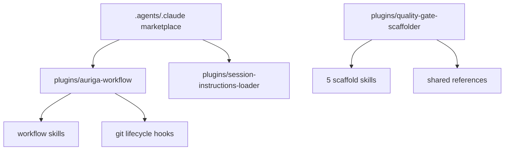
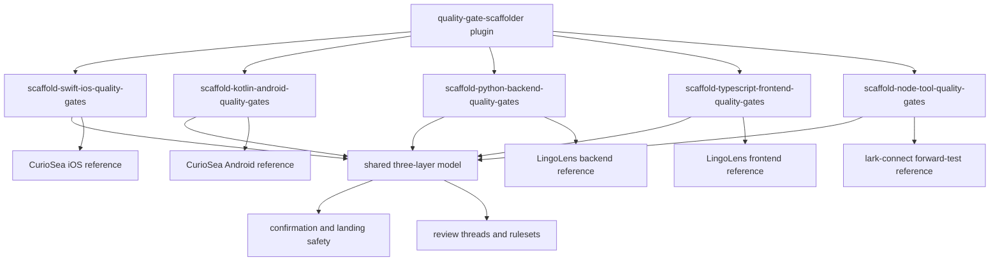

# 架构设计:quality-gate-scaffolder-plugin

## Context & Current State / 背景与现状

本设计承接 `docs/specs/quality-gate-scaffolder-plugin/spec.md`：创建一个技术栈优先的脚手架插件，把 CurioSea 生产级工程已验证的硬门禁经验沉淀为可复用的 agent 工作流，并通过 `lark-connect` 前向验证补齐 Node 工具仓库路径。

当前 `auriga-cli` 已有插件发布结构：`plugins/auriga-workflow/` 承载核心工作流 skills 和 git 生命周期 hooks，`plugins/session-instructions-loader/` 承载会话指令注入。插件通过 `.codex-plugin/plugin.json`、可选 `.claude-plugin/plugin.json`、`skills/`、`hooks/` 和 marketplace 条目发布。现有 `auriga-workflow` 已经包含需求澄清、架构设计、增量实现、评审、Git 生命周期等横向流程能力；质量门禁脚手架是更具体的工程落地知识，不应继续塞进核心工作流插件。



## Design Drivers & Constraints / 设计驱动与约束

**设计驱动**
- 可发现性 — agent 应能根据 Swift iOS、Kotlin Android、Python 后端、TypeScript 前端、Node 工具这类技术栈意图准确触发对应 skill。
- 低上下文成本 — 五个 skill 共享的三层模型和落地纪律不能在每个 `SKILL.md` 重复堆满；平台细节应按需加载。
- 可移植性 — 插件资产要同时适配 Codex 和 Claude Code 的 skill/plugin 机制，避免依赖某个运行时独有能力。
- 解耦性 — 质量门禁脚手架知识应独立于 `auriga-workflow` 的核心生命周期规则，便于单独安装、迭代和版本化。

**约束与不变量**
- 必须保留 spec 中确认的 5 个技术栈优先 skill 名称。
- 每个 skill 都必须按“检查工具、检查规则、调用时机”三层引导。
- 用户确认前不能直接写入目标仓库门禁文件；远端 GitHub 写操作必须另行确认。
- 插件不能声称支持未验证技术栈。
- 不替代 `auriga-workflow` 的需求、计划、分支、评审和 PR 生命周期规则。
- 当前仓库没有项目级 `docs/rules/arch/` 规则。

## Candidate Approaches / 候选方案

### 候选 A:独立插件 + 共享参考层
- **形状**: 新增 `plugins/quality-gate-scaffolder/`。插件内有 5 个 skill，每个 `SKILL.md` 只保留触发描述、技术栈 scope、工作流程和参考导航；共用三层模型、远端合入外壳、落地安全边界放在共享 `references/`；平台细节放在各自参考文件。
- **优点**: 技术栈触发清楚；共享原则不重复；和 `auriga-workflow` 解耦；未来可单独安装或移除。
- **缺点**: 需要新增插件 manifest、marketplace 条目和一组插件级测试/校验；安装时多一个插件。

### 候选 B:并入 `auriga-workflow`
- **形状**: 在 `plugins/auriga-workflow/skills/` 里新增 5 个脚手架 skill，并复用现有插件发布路径。
- **优点**: 用户只需安装现有插件；与 spec/arch/impl/review 生命周期天然相邻。
- **缺点**: `auriga-workflow` 会从流程引擎变成流程加工程模板知识库；插件描述和触发面膨胀；未来门禁脚手架迭代会影响核心工作流发布。

### 候选 C:单 skill + 多参考文件
- **形状**: 只新增一个 `scaffold-quality-gates` skill，通过 references 选择 Swift、Kotlin、Python、TypeScript 前端或 Node 工具路径。
- **优点**: 文件数量少；三层模型只有一份主入口。
- **缺点**: 技术栈 scope 不够显式；description 很难同时覆盖五类触发而不误召回；用户已经明确希望一个插件里有多个技术栈专属 skill。

## Tradeoff Comparison / 权衡对比

| 驱动 | 候选 A:独立插件 + 共享参考层 | 候选 B:并入 `auriga-workflow` | 候选 C:单 skill + 多参考文件 |
|---|---|---|---|
| 可发现性 | 5 个 skill 名称直接表达技术栈，触发边界清楚 | 5 个 skill 也清楚，但被核心工作流插件描述稀释 | 单 description 必须覆盖五类场景，误召回概率更高 |
| 低上下文成本 | 公共三层模型只在共享参考中维护，单个 skill 只加载相关平台细节 | 可做到共享参考，但会混在 `auriga-workflow` 既有引用结构里 | 主 skill 容易变成路由文档，首次加载成本偏高 |
| 可移植性 | 独立插件可按 Codex/Claude manifest 双发；脚手架资产自包含 | 继承 `auriga-workflow` 可移植性，但与其 hooks 一起发布 | skill 本身可移植，但缺少插件级独立发布边界 |
| 解耦性 | 脚手架知识独立版本化，不污染核心工作流 | 核心插件持续变重，任何门禁脚手架改动都进入核心插件发布 | 解耦于核心插件，但技术栈边界和用户确认不如 4 skill 明确 |

## Decision & Rationale / 选定方案与理由

- **选定**: 候选 A：独立插件 + 共享参考层。
- **决定它的驱动**: 解耦性和可发现性最关键。质量门禁脚手架是可选的工程落地知识，不是所有使用 `auriga-workflow` 的仓库都需要；同时用户明确要求一个 plugin 内按技术栈拆分多个 skill。
- **放弃了什么**: 放弃“安装一个插件就拥有全部能力”的简单安装体验，换取更清晰的能力边界。
- **否决理由**: 候选 B 会让 `auriga-workflow` 承载过多垂直知识；候选 C 不满足用户对技术栈专属 skill 的命名和 scope 要求。

## Target Structure / 目标结构

**目录概览**

```text
plugins/
  quality-gate-scaffolder/                    (新增)
    .codex-plugin/plugin.json                 (新增)
    .claude-plugin/plugin.json                (新增; 如计划阶段确认需要 Claude marketplace)
    README.md                                 (新增; 简短说明插件能力和边界)
    skills/
      scaffold-swift-ios-quality-gates/
        SKILL.md                              (新增)
        references/
          curiosea-ios-patterns.md            (新增)
      scaffold-kotlin-android-quality-gates/
        SKILL.md                              (新增)
        references/
          curiosea-android-patterns.md        (新增)
      scaffold-python-backend-quality-gates/
        SKILL.md                              (新增)
        references/
          lingolens-backend-patterns.md       (新增)
      scaffold-typescript-frontend-quality-gates/
        SKILL.md                              (新增)
        references/
          lingolens-frontend-patterns.md      (新增)
      scaffold-node-tool-quality-gates/
        SKILL.md                              (新增)
        references/
          node-tool-patterns.md               (新增)
      references/
        three-layer-model.md                  (新增)
        landing-safety.md                     (新增)
        github-review-and-rulesets.md         (新增)

.agents/plugins/marketplace.json              (改; 添加 Codex marketplace 条目)
.claude-plugin/marketplace.json               (改; 如果发布给 Claude Code,添加 marketplace 条目)
```

**模块依赖图**



## Risks & Rollback / 风险与回滚

- **风险**: 参考材料过长导致 skill 加载成本高。→ **缓解**: `SKILL.md` 只放流程和导航，平台细节放 references，按任务读取。
- **风险**: 脚手架被误用于不支持的技术栈。→ **缓解**: frontmatter description 和正文 scope 都明确限制支持范围。
- **风险**: agent 直接写远端 GitHub ruleset 或目标仓库文件。→ **缓解**: 每个 skill 都写明确认闸门，远端写操作需单独确认。
- **风险**: 插件与 `auriga-workflow` 的职责边界不清。→ **缓解**: README 和 skill 正文明确本插件只做质量门禁脚手架，不接管需求、计划、分支、评审生命周期。
- **回滚**: 删除 `plugins/quality-gate-scaffolder/`，移除 marketplace 条目；由于不改 `auriga-workflow` 既有代码，回滚半径局限于新插件和文档。

## Cross-Module Impact / 对其他模块的影响

- `plugins/quality-gate-scaffolder/` — 新增插件主体和 5 个 skill。
- `.agents/plugins/marketplace.json` — 需要添加 Codex marketplace 条目，让插件可被发现。
- `.claude-plugin/marketplace.json` — 如果计划阶段确认双 runtime 发布，需要添加 Claude Code marketplace 条目。
- `tests/` — 需要补插件形态、skill frontmatter、参考文件存在性和 marketplace 注册的仓库测试。
- `docs/specs/quality-gate-scaffolder-plugin/` — 当前活跃 spec、validation contract 和 arch design，PR Ready 前需要归档、晋升或删除。

## Consequences / 后果

- **得到的**: 五类技术栈有明确入口；共享三层模型可复用；插件可以独立安装和迭代。
- **要承受的**: 新增一个插件发布单元，需要维护 manifest、marketplace、README 和插件级测试。
- **需要后续跟进的**: 计划阶段决定是否同时发布 Claude Code manifest、参考材料的粒度、GitHub ruleset 辅助能力的边界。

## Open Questions / 未决问题

- 是否第一版同时维护 `.claude-plugin/plugin.json` 和 Claude marketplace 条目，还是先只做 Codex 插件形态；归属计划阶段，因为它影响发布范围和测试。
- 参考材料是否采用“共享 references + 各 skill references”双层结构，还是全部放在 plugin 顶层 references；归属计划阶段，因为它影响文件组织和读取指引。
