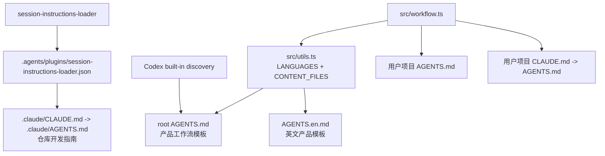
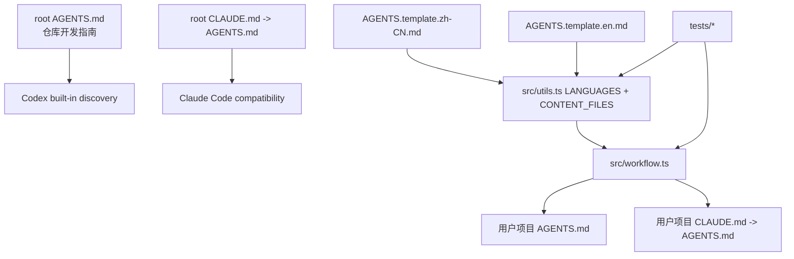

# 架构设计:产品工作流模板与仓库指令入口拆分

## Context & Current State / 背景与现状

本次重构解决 `auriga-cli` 仓库的指令文件命名冲突：根 `AGENTS.md` 现在是安装到用户项目里的工作流产品模板，但 Codex 会把根 `AGENTS.md` 当作当前仓库的项目指令入口自动加载。真正指导 `auriga-cli` 开发的是 `.claude/AGENTS.md`，再通过 `.claude/CLAUDE.md -> AGENTS.md` 和 `session-instructions-loader` 额外注入。

当前结构导致两个问题：

- Codex 自动加载的是产品模板，而不是仓库开发指南；这会让 agent 遵循“用户项目工作流”而不是“auriga-cli 开发规则”。
- `session-instructions-loader` 需要把 `.claude/CLAUDE.md` 整文件注入，实际 hook 输出完整，但宿主注入层会截断大上下文，关键规则可能不可见。

当前文件和数据流：



## Design Drivers & Constraints / 设计驱动与约束

**设计驱动**

- 指令入口正确性 — Codex 和 Claude Code 进入本仓库时应直接读取完整仓库开发指南，不依赖大段 hook 注入。
- 产品分发稳定性 — 对用户项目的安装结果不变：仍然安装实体 `AGENTS.md`，并创建 `CLAUDE.md -> AGENTS.md` 兼容软链。
- 运行时路径清晰 — 仓库内的模板源文件不再和 agent 入口文件同名；内容拉取、语言映射和测试都引用同一组模板源路径。
- 迁移影响可控 — 避免把产品模板拆名重构扩大成安装契约重写；旧安装形态迁移逻辑保持不变。

**约束与不变量**

- 用户项目中的安装产物保持 `AGENTS.md` 为主文件，`CLAUDE.md` 为兼容软链。
- `--lang zh-CN|en` 的命令行取值保持不变；默认仍是 `zh-CN`。
- 工作流受管块 marker schema 保持 `AURIGA:WORKFLOW:v1`。
- 非开发模式下 `fetchContentRoot()` 必须能从 tag 拉取新的模板源路径。
- 本 PR 可以重构仓库结构，但不应该改变 skills、plugins、preset 的默认集合。

**行为保护网**

- 更新 `tests/content-fetch.test.ts`，锁住新模板源路径会被运行时预取。
- 更新 `tests/workflow-install.test.ts`，锁住新模板源路径仍能安装成用户项目根 `AGENTS.md`。
- 更新 `tests/spec-design.test.ts`，让产品模板回归测试读取新模板路径，而不是根 `AGENTS.md`。
- 更新或删除 `session-instructions-loader` 本仓库配置，验证不再依赖注入 `.claude/CLAUDE.md`。
- 跑 `npm test`、`npm run test:session-instructions-loader`、`npm run test:git-guards`；如果触碰内容拉取或模板分发，补跑 e2e 或明确说明未跑原因。

## Candidate Approaches / 候选方案

### 候选 A:继续 root AGENTS.md 做产品模板，压缩 hook 注入

- **形状**：保留根 `AGENTS.md` 和 `AGENTS.en.md` 作为产品模板；把 `.claude/CLAUDE.md` 拆短或让 hook 只抽取关键章节。
- **优点**：产品模板路径几乎不变，安装器改动最少。
- **缺点**：根 `AGENTS.md` 仍会被 Codex 当仓库指令自动加载，核心命名冲突没有消失；hook 仍是本仓库开发指南可见性的关键路径。

### 候选 B:产品模板留在根目录但换名，根 AGENTS.md 改为开发指南

- **形状**：根 `AGENTS.md` 承载当前 `.claude/AGENTS.md` 的开发指南；根 `CLAUDE.md -> AGENTS.md`。产品模板仍放在根目录，但改名为 `AGENTS.template.zh-CN.md` 和 `AGENTS.template.en.md`。`src/utils.ts` 的语言映射和 `CONTENT_FILES` 指向新文件名，`workflow.ts` 仍把模板安装成用户项目根 `AGENTS.md`。`.claude/` 下不再保留兼容入口；本仓库 `session-instructions-loader` 配置保留为空对象，不再 extra 注入 `.claude/CLAUDE.md`。
- **优点**：Codex 自动加载的就是完整开发指南；产品模板仍在仓库根目录，用户和维护者一眼能看到；产品模板与仓库指令入口从命名上分离；不再依赖大 hook 输出。
- **缺点**：需要重命名模板文件并同步较多测试和文档路径；发布内容路径发生变化，必须 bump CLI 版本后发版。

### 候选 C:保留 root AGENTS.md 产品模板，新增 AGENTS.override.md 开发指南

- **形状**：根 `AGENTS.override.md` 写开发指南，依赖 Codex 的 fallback 顺序优先读取 override；产品模板继续保留根 `AGENTS.md`。
- **优点**：产品模板路径不变，改动小于候选 B。
- **缺点**：依赖特定 agent 的 override 发现顺序；Claude Code 仍需要额外兼容；仓库里同时存在两个根级指令文件，长期容易让人误编辑。

## Tradeoff Comparison / 权衡对比

| 驱动 | 候选 A | 候选 B | 候选 C |
|---|---|---|---|
| 指令入口正确性 | 根 `AGENTS.md` 仍是产品模板，Codex 自动加载仍错位 | 根 `AGENTS.md` 就是开发指南，入口直接正确 | Codex 可正确，但依赖 `AGENTS.override.md` 优先级；Claude 还要另配 |
| 产品分发稳定性 | 分发路径不变 | 仓库源文件名变，安装产物不变 | 分发路径不变 |
| 运行时路径清晰 | 产品模板和仓库入口继续同名 | 产品模板仍在根目录，但用 `AGENTS.template.*.md` 明确表达“模板源”身份 | 根目录有 `AGENTS.override.md` + `AGENTS.md` 两套入口，解释成本高 |
| 迁移影响可控 | 短期最少，但保留长期问题 | 中等改动，一次解决命名冲突 | 小到中等改动，但留下 agent 特定行为依赖 |

## Decision & Rationale / 选定方案与理由

- **选定**：候选 B，产品模板保留在根目录但改名为 `AGENTS.template.zh-CN.md` / `AGENTS.template.en.md`，根 `AGENTS.md` 改为仓库开发指南。
- **决定它的驱动**：指令入口正确性和运行时路径清晰。当前问题的根因是同名文件承担两种身份，只有拆名才能消除冲突。
- **放弃了什么**：放弃候选 A 的最小改动，因为它只能缓解截断，不能解决 Codex 自动加载错误内容；放弃候选 C 的短路径，因为它依赖 `AGENTS.override.md` 这类 agent 特定优先级，且根目录仍保留两个容易混淆的指令入口。
- **迁移形态**：并行变更。仓库模板源文件在根目录换名，同时保持用户项目安装产物和旧安装迁移逻辑不变。

## Target Structure / 目标结构

**目录概览**

```text
auriga-cli/
  AGENTS.md                         (改: 仓库开发指南, 来自当前 .claude/AGENTS.md)
  CLAUDE.md -> AGENTS.md            (保留: Claude Code 兼容入口)
  AGENTS.en.md                      (删/迁移: 不再作为产品模板)
  AGENTS.template.zh-CN.md          (新增: 中文产品工作流模板, 原 root AGENTS.md)
  AGENTS.template.en.md             (新增: 英文产品工作流模板, 原 root AGENTS.en.md)
  .claude/                          (删兼容入口: 不再保留 AGENTS.md / CLAUDE.md 软链)
  .agents/
    plugins/
      session-instructions-loader.json (改为空对象: 本仓库不再 extra 注入 .claude/CLAUDE.md)
  src/
    utils.ts                        (改: DEFAULT_WORKFLOW_TEMPLATE_FILE, LANGUAGES, CONTENT_FILES)
    workflow.ts                     (改: 从新模板源路径读取, 安装目标仍是 AGENTS.md)
    workflow-markers.ts             (改: 注释里的模板路径说明)
  tests/
    content-fetch.test.ts           (改)
    workflow-install.test.ts        (改)
    spec-design.test.ts             (改)
    preset.test.ts / install-nontty.test.ts (如有 mock 路径, 改)
```

**模块依赖图**



## Risks & Rollback / 风险与回滚

- **风险**：`fetchContentRoot()` 在非开发模式下漏拉 nested template 路径 → **缓解**：`content-fetch` 测试断言所有新路径都被请求；必要时跑 e2e。
- **风险**：安装器把模板源文件名当安装目标文件名，错误创建 `AGENTS.template.*.md` → **缓解**：`workflow.ts` 继续只用 `WORKFLOW_PRIMARY_FILE = "AGENTS.md"` 作为目标；安装测试断言用户项目根文件。
- **风险**：`.claude/AGENTS.md` / `.claude/CLAUDE.md` 删除后，某些文档或 hook 仍引用旧路径 → **缓解**：本 PR 同步更新当前契约文档和本仓库 `session-instructions-loader` 配置；测试不再依赖 `.claude/CLAUDE.md` 额外注入。
- **风险**：根 `AGENTS.md` 变长后影响 Codex 内置注入预算 → **缓解**：这比 hook 额外注入更稳定；若仍过大，再把开发指南拆分为根入口 + `docs/rules/` 专题文档。
- **回滚**：可把 `src/utils.ts` 的语言映射改回根模板路径，并恢复 root `AGENTS.md` / `AGENTS.en.md`，安装产物契约不受影响。

## Cross-Module Impact / 对其他模块的影响

- `src/utils.ts` — 新模板源文件名和内容文件清单。
- `src/workflow.ts` — 读取新模板路径，但安装目标不变。
- `tests/content-fetch.test.ts` — 网络拉取路径变更。
- `tests/workflow-install.test.ts` — packageRoot fixture 需要创建 `AGENTS.template.*.md`。
- `tests/spec-design.test.ts` — 产品模板断言改读新路径；根 `AGENTS.md` 不再是产品模板。
- `.claude/AGENTS.md` / `.claude/CLAUDE.md` / root `AGENTS.md` / root `CLAUDE.md` — 仓库指令入口收敛到根 `AGENTS.md` 和根 `CLAUDE.md`。
- `.agents/plugins/session-instructions-loader.json` — 保留为空对象，本仓库不再额外注入 `.claude/CLAUDE.md`。
- `README*`、根 `AGENTS.md` 中的数据源和版本规则说明 — 需要把产品模板路径改成 `AGENTS.template.*.md`。

## Consequences / 后果

- **得到的**：Codex/Claude 默认读取完整仓库开发指南；产品模板和仓库指令入口不再抢同一个根文件名；hook 不再需要为本仓库注入大文件。
- **要承受的**：一次性重命名模板源文件，触发内容拉取、测试 fixture、文档说明的多处同步。
- **需要后续跟进的**：本 PR 会改用户可见模板源路径和工作流模板内容路径，发版前需要和本次 #144 一起 bump `package.json`；如果模板契约内容没有变化，workflow header 可不单独 bump。

## Open Questions / 未决问题

- 无。用户已明确：产品模板保留根目录但换名；`.claude/` 下不保留兼容入口；`.agents/plugins/session-instructions-loader.json` 保留为空配置。
