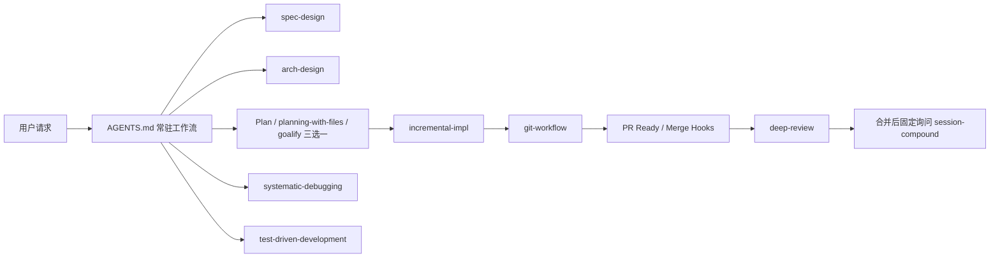
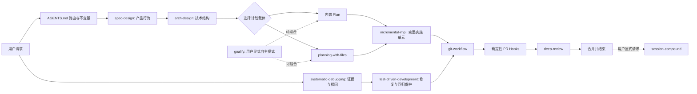
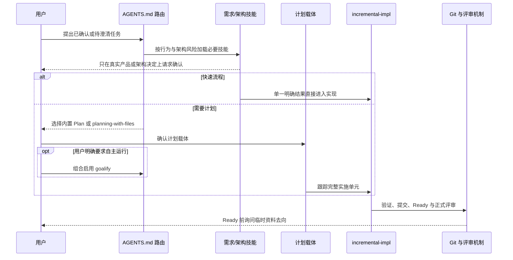

# 架构设计：工作流组合收敛

## Review Focus / 人工评审重点

- **评审状态**：已确认
- **核心决定**：`AGENTS.md` 只保存常驻路由和不变量；内置 Plan 与 `planning-with-files` 二选一，`goalify` 可组合；缺陷诊断与测试驱动实现顺序触发。
- **主要影响**：中英文工作流模板、仓库示例入口、`spec-design` 与测试/调试技能交接、契约测试和发布版本。
- **技术质量重点**：降低常驻上下文成本，同时保持人工确认、双运行时一致性和确定性 Git 门禁。
- **首要风险**：过度压缩可能让模型漏掉必要技能路由；只改模板而不改技能触发和测试会造成跨资产漂移。

## Current Architecture / 当前架构现状



### Current Directory Structure / 当前目录结构

```text
auriga-cli/
├── AGENTS.md
├── AGENTS.template.zh-CN.md
├── AGENTS.template.en.md
├── plugins/auriga-workflow/
│   ├── .claude-plugin/plugin.json
│   ├── .codex-plugin/plugin.json
│   ├── README.md
│   └── skills/
│       ├── spec-design/SKILL.md
│       ├── systematic-debugging/SKILL.md
│       ├── test-driven-development/SKILL.md
│       └── goalify/SKILL.md
├── tests/
│   ├── auriga-workflow-skills.test.ts
│   ├── goalify.test.ts
│   └── spec-design.test.ts
├── package.json
└── docs/long-running-specs/model-generation-workflow-upgrade/
    ├── umbrella.md
    └── reviews/README.md
```

## Context & Problem / 背景与问题

单项技能已经分别完成现代化，但组合入口仍保留旧路由：计划载体与自主模式混为三选一；快速流程由模块数和验收条目数决定；缺陷请求会同时匹配诊断和修复实现；合并后固定增加复盘询问。`AGENTS.md` 还复制了多个技能内部的步骤、豁免和输出要求，使每次会话都支付这些上下文成本。

## Goals & Non-Goals / 目标与非目标

**目标**

- 让 `AGENTS.md` 成为稳定、低冗余的路由入口。
- 保留用户确认的计划选择、Ready 资料处置和架构评审门禁。
- 让缺陷诊断、修复测试与增量实施按职责顺序衔接。
- 保持中文、英文、仓库示例、技能和测试一致。

**非目标**

- 不重写单项技能内部流程。
- 不修改 Git Hook 的阻塞逻辑。
- 不评审独立的 `quality-gate-scaffolder` 插件。

## Constraints & Invariants / 约束与不变量

- **用户可观察行为**：需要计划的任务仍在实现前选择计划载体；实质性架构决定仍需用户确认；Ready 前仍询问临时资料去向；首次正式评审仍使用 `deep-review`。
- **公共契约**：受管区块 marker、双语模板安装形态、`CLAUDE.md -> AGENTS.md` 兼容软链接和 Hook 入口不变。
- **项目规则**：无项目专属架构规则；模板和插件用户可见变化需要同步版本与发布资产。
- **其他约束**：Claude Code 与 Codex 都必须能理解相同路由；不能依赖某一运行时专属的计划或代理 API 才成立。

## Quality Attributes & Technical Goals / 质量属性与技术目标

| 质量属性 | 技术目标或约束 | 为什么影响本次架构 | 设计响应 | 如何验证或观测 |
|---|---|---|---|---|
| 上下文效率 | 常驻入口只保留路由和不变量 | 每次会话都会加载受管区块 | 删除技能正文已有的步骤、配额、豁免和输出教学 | 比较模板内容并用契约测试禁止旧规则回归 |
| 可维护性 | 一个组合规则只有一个权威来源 | 模板、技能和测试同时复制会产生漂移 | 模板负责路由，技能负责执行，Hook 负责确定性阻塞 | 双语与跨技能契约测试 |
| 可审查性 | 人工决定点必须一眼可见 | 压缩不能隐藏用户确认门禁 | 在顶部工作流保留计划、架构和 Ready 三类确认 | 人工审阅中英文模板 |
| 跨运行时一致性 | Claude Code 与 Codex 得到等价语义 | 两个运行时的计划与目标能力不同 | 使用能力类别描述，不写死工具参数或模型型号 | 双清单版本和安装测试 |
| 可逆性 | 路由精简出现漏触发时能局部恢复 | 总入口影响所有项目 | 仅修改文字契约和触发描述，不改变 Hook 数据协议 | 契约测试、真实安装和回滚到前一版本 |

## Proposed Design / 建议设计

### Target Architecture / 目标整体架构



### Target Directory Structure / 目标目录结构

```text
auriga-cli/
├── AGENTS.md                                      （改）
├── AGENTS.template.zh-CN.md                       （改）
├── AGENTS.template.en.md                          （改）
├── plugins/auriga-workflow/
│   ├── .claude-plugin/plugin.json                 （改）
│   ├── .codex-plugin/plugin.json                  （改）
│   ├── README.md                                  （改）
│   └── skills/
│       ├── spec-design/SKILL.md                   （改）
│       ├── systematic-debugging/SKILL.md          （改）
│       └── test-driven-development/SKILL.md       （改）
├── tests/
│   ├── auriga-workflow-skills.test.ts             （改）
│   └── spec-design.test.ts                        （改）
├── package.json                                   （改）
├── package-lock.json                              （改）
└── docs/long-running-specs/model-generation-workflow-upgrade/
    ├── umbrella.md                                （改）
    └── reviews/README.md                          （改）
```

### Responsibilities & Boundaries / 职责与边界

- `AGENTS.md`：决定何时进入哪个能力、哪些人工决定不能跳过、哪些完成声明必须有证据；不教授技能内部流程。
- 技能 frontmatter：决定初始触发边界；正文负责能力内部执行与相邻技能交接。
- 内置 Plan / `planning-with-files`：互斥的计划与状态载体。
- `goalify`：用户显式启用的自主执行模式，不替代计划载体。
- Git Hook：只执行可确定的文件、推送和拉取请求清单门禁。
- 契约测试：保护上述边界和双语一致性，不对完整自然语言做脆弱快照。

### Dependencies & Interfaces / 依赖与接口

| 上游依据 | 接缝 | 提供方 → 调用方 | 技术形态 | 错误与兼容策略 |
|---|---|---|---|---|
| VAL-PLANNING-001..003 | 实现前路由 | `AGENTS.md` → 计划载体 / `goalify` / `incremental-impl` | 自然语言决策规则 | 没有计划需求时允许快速流程；有计划需求时不得省略用户选择 |
| VAL-DEBUGGING-001..002 | 缺陷交接 | `systematic-debugging` → `test-driven-development` | frontmatter + 正文交接 | 根因未确认时不进入永久修复；无有效测试接缝时记录限制 |
| VAL-LIFECYCLE-001..003 | 拉取请求生命周期 | `AGENTS.md` / `git-workflow` → Hook / `deep-review` | 文档路由 + 确定性脚本 | Hook 协议不变；只删除合并后的固定复盘提示 |
| VAL-CONTEXT-001..004 | 常驻上下文 | 模板 → 安装后的 `AGENTS.md` | 受管区块安装 | 中英文和根示例同步，旧受管区块由现有升级机制替换 |

### Data Flow / 数据流



## Migration & Behavior Protection / 迁移与行为保护

- **迁移方式**：显式切换；新版本模板整体替换受管区块，技能与测试在同一发布中更新。
- **中间状态与兼容窗口**：同一提交同时维护中英文模板、根示例、技能交接与契约测试，不允许半同步状态进入 Ready。
- **切换信号**：契约测试、官方技能验证、真实安装测试和双运行时清单一致性全部通过。
- **行为保护**：现有 workflow marker、安装、Ready Hook、合并 Hook 和正式评审测试保持通过；新增测试覆盖计划组合、语义快速流程和缺陷顺序。
- **回滚条件**：安装结果缺失必要路由、双语语义不一致、缺陷修复漏掉测试保护，或计划载体选择被错误跳过。
- **旧路径删除条件**：新契约测试覆盖并确认不再引用三谓词、三选一菜单和合并后固定复盘提示。
- **负责人**：当前工作流组合收敛拉取请求负责完整切换与归档。

## Risks & Validation / 风险与验证

| 风险或假设 | 影响 | 缓解或验证方式 |
|---|---|---|
| 语义快速流程过于宽泛 | 非平凡任务可能跳过计划 | 同时要求单一结果、无未决决定、无需持久跟踪且无需多个完整单元 |
| 缩窄测试技能触发导致漏用 | 缺陷修复没有回归保护 | 调试正文明确交接，工作流和测试技能契约共同覆盖 |
| 模板压缩造成信息丢失 | 用户项目不知道文档或代理路由 | 保留目录表、运行框架核心原则和代理安全边界 |
| 版本资产不同步 | 安装得到旧模板或旧技能 | 包版本、工作流版本、双插件清单、README 与端到端安装一起验证 |

## Human Decisions / 人工确认结果

- 内置 Plan 与 `planning-with-files` 在进入实现前二选一；`goalify` 可以与任一计划载体组合。
- 快速流程改为语义判断，不再使用模块数或验收标准数量。
- Ready 前继续询问当前拉取请求临时资料的删除或归档去向。
- 删除合并后固定询问 `session-compound`。
- 缺陷先诊断根因，进入修复后再加载测试驱动开发。
- `docs/rules/` 总入口保留。
- “持续对抗熵增”保留，并明确用于评审发现的技术债务决策。
- 其他常驻入口精简、目录和代理分发调整按本设计执行。
