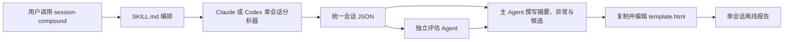
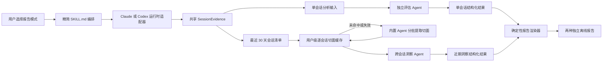
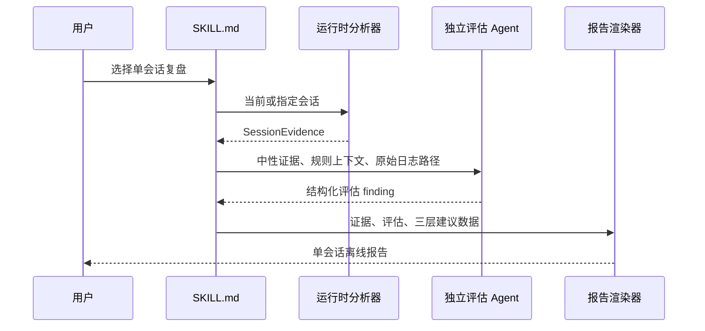
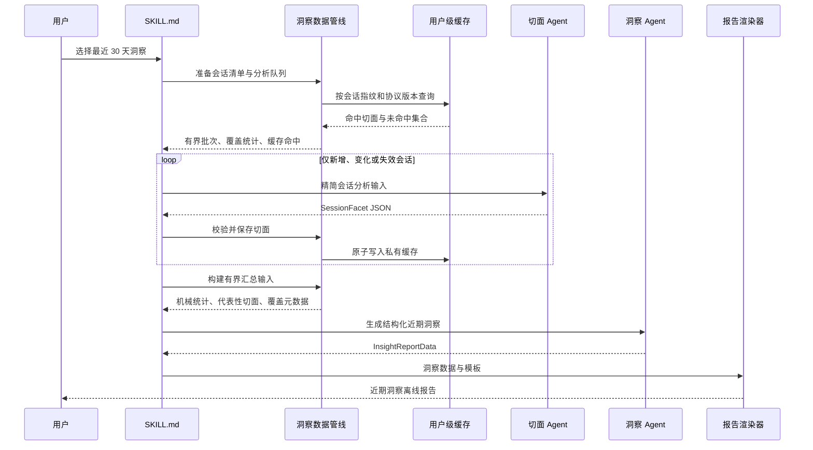

# 架构设计：session-compound 现代化

> 归档自 PR #193 的已确认架构设计；作为本次实现与正式评审的设计依据。

## Review Focus / 人工评审重点

- **评审状态**：已确认
- **核心决定**：保留单会话分析器，以共享证据契约承接两种报告；新增确定性的近期洞察数据管线、逐会话语义切面缓存和统一渲染器，模型只负责结构化语义判断。
- **主要影响**：`session-compound` 的技能入口、Claude Code 与 Codex 分析器、独立评估协议、报告模板、测试夹具，以及用户级缓存目录。
- **技术质量重点**：最近 30 天出现上百个会话时仍可增量、可恢复地运行；所有结论可追溯；缓存可删除重建且不泄露完整会话；两种运行时保持同一语义契约。
- **首要风险**：Auriga 没有跨运行时统一的模型接口，多会话语义分析必须通过宿主的内置 Agent 分批完成；若批次、缓存失效和部分结果边界处理不清，会出现成本失控或用不完整样本生成确定性结论。

## Current Architecture / 当前架构现状

当前只有单会话流程。技能正文负责定位会话、运行对应分析器、派遣独立评估、撰写候选，再复制并手工修改 HTML 模板中的多个位置。



### Current Directory Structure / 当前目录结构

```text
plugins/auriga-workflow/skills/session-compound/
├── SKILL.md
├── analyzers/
│   ├── claude-code.mjs
│   ├── codex.mjs
│   └── skill-catalog.mjs
├── references/
│   └── eval-dispatch.md
└── template.html
tests/
├── session-compound-analyzers.test.mjs
└── auriga-workflow-skills.test.ts
```

## Context & Problem / 背景与问题

当前结构有四个相互强化的问题：

1. 两个分析器各自扫描单个日志并直接组装完整报告数据，公共概念只能靠重复代码和测试维持对称。
2. `SKILL.md` 同时承担流程编排、候选分类教材、生态搜索、模型提示词和模板编辑说明，已经达到 352 行。
3. `template.html` 同时包含 1200 行样式、结构、数据占位和交互逻辑；模型需要按位置编辑多个区块，结构完整性依赖提示词纪律。
4. 多会话洞察需要会话清单、增量语义切面、缓存失效、代表性证据选择和独立报告结构，不能作为更多条件分支继续塞进现有单会话模板。

此外，Codex 分析器只识别显式 `<skill>` 注入，导致正常读取 `SKILL.md` 的使用证据丢失；工具非零退出也在过早阶段被聚合成“浪费”。这些问题说明共享边界应该是中性证据，而不是已经带结论的报告字段。

## Goals & Non-Goals / 目标与非目标

**目标**

- 两种模式共享运行时发现、证据类型、来源标记和渲染安全边界，但拥有各自适合的报告结构。
- 最近 30 天出现上百个会话时，只对新增、变化或分析协议失效的会话重新做语义分析。
- 模型输出必须经过结构校验才能进入缓存和报告；模型不再编辑 HTML、JavaScript 或 CSS。
- 单个会话、单个语义批次或单个报告章节失败时保留可恢复进度，并准确披露覆盖率。
- 保持 Claude Code 与 Codex 的共享语义一致，同时允许各自提供不同的原生证据。

**非目标**

- 不提供跨 Claude Code 与 Codex 的合并洞察。
- 不建立常驻服务、数据库或远程同步层。
- 不保存完整会话副本，也不把缓存变成新的事实源。
- 不让 Node.js 脚本直接调用某个厂商模型接口或要求用户配置额外模型密钥。
- 不在架构设计中规定实施顺序、提交切片或 Agent 分发数量。

## Domain Model / 领域模型

| 概念 | 职责与行为 | 身份或生命周期 | 必须保持的不变量 |
|---|---|---|---|
| `SessionDescriptor` | 描述一个可发现会话的运行时、源文件、时间范围、完成状态与内容指纹 | 由 `runtime + session_id` 唯一标识；源日志变化时指纹变化 | 只描述来源，不包含语义判断 |
| `SessionEvidence` | 保存从一个会话确定性提取的统计、用户轮次、工具事件、技能使用和证据来源 | 随源日志与分析器协议产生；可重新生成 | 原始事实与语义判断分离；未知不写成零 |
| `SkillUsageEvidence` | 表达一次技能使用的名称、证据类型和执行事件 | 属于一个会话；证据类型为显式或推断 | 推断使用不能冒充显式调用；同轮重复读取不放大 |
| `SessionFacet` | 用短结构概括会话目标、结果、正向模式、摩擦、用户指令和证据引用 | 由会话指纹、切面结构版本和分析提示版本共同决定有效性 | 不保存完整转写；所有语义结论能回到会话和证据片段 |
| `FacetCacheEntry` | 包装切面及其失效元数据 | 可删除派生缓存；命中条件全部相等才可复用 | 缓存不是事实源；损坏、过期或版本不符即视为未命中 |
| `InsightObservation` | 表达跨会话洞察或单次观察 | 每次近期洞察重新聚合 | “反复模式”至少关联两个独立会话 |
| `Suggestion` | 表达低承诺试验或长期沉淀候选 | 属于一份报告；人工选择前不改变工程 | 洞察、值得尝试、长期候选具有不同承诺等级和默认动作 |

## Constraints & Invariants / 约束与不变量

- **用户可观察行为**：每次调用先选择一种模式；单会话与近期洞察分别生成独立离线报告；零建议和零候选合法。
- **公共契约**：现有单会话报告仍能消费两种运行时的共享证据；新字段演进通过 `schema_version` 明确切换，不让模板猜测字段含义。
- **项目规则**：无项目专属架构规则。
- **运行时边界**：Claude Code 和 Codex 都支持内置 Agent，但没有统一的程序化模型接口；语义分析通过宿主内置 Agent 执行，确定性脚本不绑定厂商接口。
- **缓存边界**：缓存位于用户级 `~/.cache/auriga-cli/session-compound/`，不进入仓库、`~/.claude/` 或 `~/.codex/`；删除后可以从原始日志重建。
- **安全边界**：缓存目录权限为 `0700`、文件为 `0600`；缓存只保存结构化切面、来源指纹和有限证据引用，不复制完整转写。

## Quality Attributes & Technical Goals / 质量属性与技术目标

| 质量属性 | 技术目标或约束 | 为什么影响本次架构 | 设计响应 | 如何验证或观测 |
|---|---|---|---|---|
| 性能与成本 | 重复运行只语义分析新增、变化或协议失效的会话；首次大量会话不会无上限派遣 | 最近 30 天可能有上百个会话 | 逐会话切面缓存、内容指纹、结构与提示版本、单次语义预算和可恢复队列 | 报告显示发现数、有效数、缓存命中、重新分析、失败与预算未处理数 |
| 可恢复性 | 某个会话或批次失败不丢失其他已完成切面，不阻塞事实统计 | 模型输出和日志都可能局部损坏 | 每个会话独立缓存；校验后原子写入；失败保留在覆盖统计中 | 中断后重跑只处理未完成项；损坏缓存可单独重建 |
| 可排查性 | 每个数字和语义结论能区分机械事实、模型分析和当前规则回看 | 当前报告把零值、浪费和历史判断混在一起 | 统一证据类型、来源时点、会话标识与覆盖元数据 | 抽查报告结论可以定位到会话和代表性证据 |
| 安全性 | 派生缓存不扩大完整会话的暴露面 | 会话含代码路径、用户反馈和潜在敏感内容 | 用户级私有权限；不缓存完整转写；报告继续作为一次性本地文件 | 权限测试、缓存内容审查、删除缓存后可重建 |
| 可移植性 | 两个运行时使用同一领域契约，不要求额外 API 密钥 | Auriga 同时发布给 Claude Code 与 Codex | 运行时适配器负责发现和原生证据；宿主内置 Agent 负责语义分析 | 同构输入的共享字段、状态和报告语义一致 |
| 可维护性 | 技能正文只保留编排与门禁，报告结构不由模型修改 | 当前正文和模板已过大 | 详细派遣协议下沉到 references；模板与数据分离；统一渲染器只接受校验后的 JSON | 结构测试可在不运行模型的情况下生成两种报告 |

## Proposed Design / 建议设计

### Target Architecture / 目标整体架构



与当前图相比，主要变化是：模型输出停在结构化结果边界；缓存只服务近期洞察；最终 HTML 由同一个确定性渲染入口生成，但两种模式使用不同模板。

### Target Directory Structure / 目标目录结构

```text
plugins/auriga-workflow/skills/session-compound/
├── SKILL.md                                      （改）
├── analyzers/
│   ├── claude-code.mjs                           （改）
│   ├── codex.mjs                                 （改）
│   └── skill-catalog.mjs                         （改）
├── scripts/                                      （新增）
│   ├── insights-pipeline.mjs                     （新增）
│   └── render-report.mjs                         （新增）
├── templates/                                    （新增）
│   ├── single-session.html                       （新增，承接现有模板）
│   └── recent-insights.html                      （新增）
├── references/
│   ├── eval-dispatch.md                          （改）
│   ├── facet-dispatch.md                         （新增）
│   └── insights-dispatch.md                      （新增）
└── template.html                                 （删除）
tests/
├── session-compound-analyzers.test.mjs           （改）
├── session-compound-insights.test.mjs            （新增）
└── auriga-workflow-skills.test.ts                 （改）
```

`insights-pipeline.mjs` 是一个深模块：对外只提供准备分析、校验并保存切面、构建汇总输入三类命令；内部隐藏会话发现、指纹、缓存命中、预算、代表性选择和覆盖统计。它不调用模型，也不渲染页面。

`render-report.mjs` 只接受模式、模板和经过校验的数据，负责安全注入并写出最终 HTML。它不分析会话，也不生成建议。

### Responsibilities & Boundaries / 职责与边界

| 组件 | 负责 | 明确不负责 |
|---|---|---|
| 运行时分析器 | 定位或读取单个运行时日志，提取确定性 `SessionEvidence` | 跨会话趋势、候选判断、缓存、HTML |
| 近期洞察数据管线 | 枚举 30 天会话、过滤无效记录、计算指纹、管理切面缓存、构建有界汇总输入 | 模型调用、语义结论、页面展示 |
| 切面 Agent | 从一个或一批会话的精简分析输入生成逐会话 `SessionFacet` | 跨会话结论、写缓存、直接生成 HTML |
| 洞察 Agent | 从覆盖统计、机械聚合和有界切面集合生成洞察、尝试建议与候选原料 | 修改工程、判断缓存有效性、编辑模板 |
| 独立评估 Agent | 单会话的规则遵循、技能召回和技能执行评估 | 多会话教练报告、自动沉淀 |
| 报告渲染器 | 校验模式数据、安全注入、自包含 HTML 输出 | 语义分析、候选筛选、缓存管理 |
| `SKILL.md` | 询问模式、调用确定性脚本、派遣内置 Agent、交付报告与人工选择结果 | 复述全部数据协议、手工改 HTML、复制下游管理技能流程 |

### Dependencies & Interfaces / 依赖与接口

| 上游依据 | 接缝 | 提供方 → 调用方 | 技术形态 | 错误与兼容策略 |
|---|---|---|---|---|
| VAL-MODE-002、VAL-SKIL-001..003 | `SessionEvidence` | 运行时分析器 → 单会话流程、近期洞察管线 | 带 `schema_version` 的 JSON；共享字段同形，运行时扩展隔离 | 缺失为显式未知；结构版本不兼容时失败并提示，不静默猜测 |
| VAL-MODE-003 | `SessionDescriptor[]` | 运行时适配器 → 近期洞察管线 | 会话标识、时间、源路径、完成状态、内容指纹 | 单个损坏会话进入排除统计，不中断清单 |
| 性能与安全目标 | `FacetCacheEntry` | 洞察管线 ↔ 用户级缓存 | 每会话一个私有 JSON，含指纹、结构版本、提示版本、完成状态与切面 | 任何失配视为未命中；校验后临时文件原子替换；损坏条目隔离重建 |
| VAL-INS-001..004 | `SessionFacet` | 切面 Agent → 洞察管线 | 严格 JSON：目标、结果、正向模式、摩擦、用户指令、简短摘要、证据引用 | 不可解析或缺必填证据则不入缓存，记录为分析失败 |
| VAL-CAND-001..005 | `InsightReportData` | 洞察 Agent → 渲染器 | 结构化章节、三层建议、来源会话、覆盖元数据 | 未达到重复证据门禁的条目只能降为单次观察或删除 |
| VAL-EVAL-001 | `SingleSessionEvaluation` | 独立评估 Agent → 单会话结果 | 保留现有 finding 结构并增加证据来源类型 | 评估失败时报告事实层仍生成，评估区显示未完成而非空白成功 |
| VAL-MODE-004 | `render-report` | 两种结构化结果 → 最终 HTML | 模式化命令行入口；只替换预定义 JSON 数据槽 | 输出前做结构与脚本闭合安全校验；失败不留下半成品 |

### Data Flow / 数据流

#### 单会话模式



#### 近期洞察模式



多会话的原始日志只在运行时分析器或切面分析阶段按需读取。缓存命中后，后续报告不再读取该会话完整转写，只读取短切面。所有有效切面都可以贡献机械计数；进入最终模型汇总的代表性细节保持有界，并披露实际使用数量。

### Deployment & Operations / 部署与运行

不新增服务或后台进程。缓存结构为：

```text
~/.cache/auriga-cli/session-compound/
└── facets/
    ├── claude-code/
    │   └── <session-id>.json
    └── codex/
        └── <session-id>.json
```

不维护独立、可漂移的全局索引文件；每次运行从原始会话目录构建当次清单，并扫描对应运行时的切面文件。上百个小型 JSON 的目录扫描成本远低于维护第二份索引一致性的复杂度。

缓存命中要求 `runtime + session_id + content_fingerprint + facet_schema_version + analysis_prompt_version` 全部一致。进行中的会话标记为未完成，后续运行必须重新确认指纹；分析协议升级时只对当前 30 天范围内实际需要的会话惰性重建，不做全历史迁移。

报告继续写入系统临时目录。用户可以直接删除 `~/.cache/auriga-cli/session-compound/`；下一次运行从原始日志逐步重建，不需要迁移或修复命令。

## Alternatives & Tradeoffs / 备选与取舍

| 方案 | 具体收益 | 具体代价 | 结论 |
|---|---|---|---|
| 两种报告共享证据契约、分别使用模板，逐会话缓存语义切面 | 单会话行为可保护；多会话可增量；报告结构各自聚焦；两个运行时保持统一边界 | 新增缓存协议、两个模板和多会话派遣协议 | **采用**；这是满足双模式、成本和可维护性的最简完整方案 |
| 在现有 `template.html` 和 `SKILL.md` 中继续增加模式条件 | 文件最少，短期改动集中 | 1200 行模板和 352 行正文继续膨胀；模型手工编辑风险扩大；两种报告问题域混在一起 | 否决；维护成本和报告可靠性不满足目标 |
| Claude Code 直接调用内置 Insights，Codex 另写一套 | Claude 侧交付最快，复用官方实现 | 两种运行时行为、数据和隐私边界不同；无法控制官方提示词和固定数量偏差 | 否决；不满足 Auriga 的双运行时共同契约 |
| 每次重新分析最近 30 天全部原始会话，不持久缓存 | 无缓存失效协议，结果总基于当前提示词 | 上百会话时成本和等待不可接受；失败后无法续接 | 否决；用户已明确关注规模问题 |
| 由脚本直接调用厂商模型接口 | 可精确控制批次、并发和结构化输出 | 需要额外密钥和厂商适配，绕开宿主权限与计费边界 | 否决；采用宿主内置 Agent 更符合现有运行方式 |

## Migration & Behavior Protection / 迁移与行为保护

- **迁移方式**：显式切换。该技能没有外部程序化调用方，团队规模小；不维护长期新旧双路径。
- **中间状态与兼容窗口**：开发期间允许新渲染器先消费现有单会话数据契约，但合入时只保留新入口；缓存仅由新近期洞察模式创建。
- **切换信号**：现有单会话代表性报告在新渲染路径中可用，两种运行时共享契约测试通过，近期洞察能完成首次、缓存命中和部分失败三种路径。
- **行为保护**：现有 55 条分析器测试作为基线；新增显式与推断技能使用、证据未知、缓存命中与失效、结构化渲染和两种报告人工检查。
- **回滚条件**：新渲染器无法稳定复现单会话报告，或近期洞察在缓存命中后仍重复分析全部会话，则停止切换并保留当前发布版本。
- **旧路径删除条件**：新模板覆盖现有四类单会话信息，且不存在依赖模型编辑 HTML 的测试或文档后，删除根目录旧 `template.html` 及对应手工注入说明。
- **负责人**：当前子 PR 的实现者负责删除过渡路径和更新本技能的双运行时契约。

## Risks & Validation / 风险与验证

| 风险或假设 | 影响 | 缓解或验证方式 |
|---|---|---|
| 首次运行有大量未缓存会话 | 等待时间和 Agent 调用数过高 | 对未缓存会话设置单次语义预算并保存已完成切面；报告明确部分覆盖，下次从未完成处继续 |
| 代表性选择偏向最新或问题会话 | 洞察忽略稳定的成功模式或项目多样性 | 选择同时考虑近期性、项目分布、用户纠正、正向结果和摩擦；报告披露参与汇总的切面数 |
| 模型输出 JSON 不合法或缺少证据 | 污染缓存，后续报告反复传播错误 | 切面和洞察都在确定性边界校验；失败不入缓存，单条失败不终止其他会话 |
| 提示词升级导致大量缓存失效 | 一次升级触发高成本重建 | 提示版本显式化并对 30 天窗口惰性重建；旧缓存可共存到被替换或清理 |
| 缓存摘要包含敏感信息 | 派生数据扩大本机暴露面 | 私有权限、不保存完整转写、限制证据摘录；提供直接删除路径 |
| 推断技能使用存在误报 | 技能执行评估范围被错误扩大 | 只认指向实际 `SKILL.md` 的读取证据，按用户轮次去重并始终标为推断，不与显式调用合并成同一计数 |
| 两种模式使技能再次膨胀 | 新模型每次加载过多流程细节 | 主文档只保留路由、硬门禁与交接；切面、洞察和评估协议按需读取 |

## Human Decisions / 人工确认结果

- 已确认同时保留“单会话复盘”和“近期使用洞察”两种模式。
- 已确认每次调用都先询问模式，不根据措辞默认选择。
- 已确认近期洞察默认覆盖最近 30 天。
- 已确认采用本架构设计及其缓存、模板和跨运行时边界，可以进入实施阶段。
